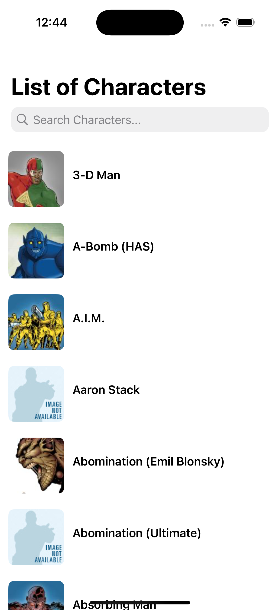
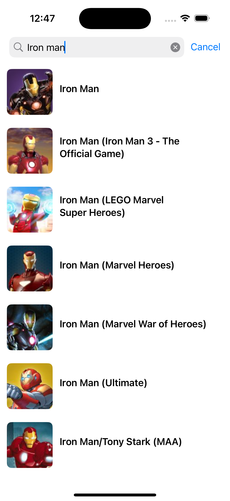
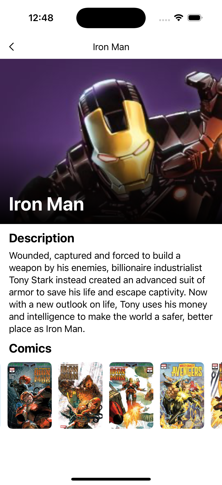
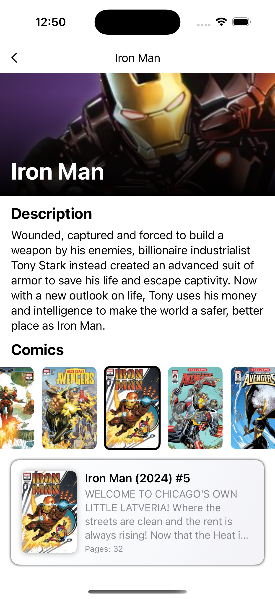

# WallaMarvel

A simple iOS app that fetches and displays a list of Marvel superheroes, built as part of the Wallapop iOS technical test.
<br/><br/>

<p align="left">
  
  
  
  
</p>

## ✨ Features

- List of Marvel superheroes with pagination  
- Superhero search functionality  
- Superhero detail view showing paginated list of comics and related information  
- Accessibility to make the app usable and enjoyable for everyone, including users who depend on assistive technologies
<br/><br/>

## 🏗️ Architecture & Design Patterns

This project follows a **clean MVVM (Model-View-ViewModel) architecture** and is structured in **three main layers** to ensure clear separation of concerns:
- **Presentation**: Contains the SwiftUI views and their ViewModels, managing UI state and user interactions.
- **Domain**: Contains use cases, domain models used in views, and mappers that transform data entities into models ready for presentation.
- **Data**: Handles all data-related tasks, including repositories, data sources, and entities, as well as the logic for API calls.

Additional patterns and best practices:
- **Coordinator pattern**: Used for managing navigation throughout the app, ensuring a single source of truth for routing and improving scalability.
- **Dependency Injection (DI)**: Dependencies are injected to simplify testing and maintainability.
- **Combine and async/await**: Adopted to handle asynchronous data fetching and updates in a reactive and modern way.
- **Accessibility first**: Designed to be usable by everyone, leveraging SwiftUI’s built-in accessibility APIs and enhancements.
<br/><br/>

## 🛠️ Setup

### Local Configuration

This project uses a `.xcconfig` file (`Config.xcconfig`) to store sensitive information like API keys. To get started:

1. Copy the example file:
```
cp ConfigExample.xcconfig Config.xcconfig

```

2. Open `Config.xcconfig` and fill in the required values
<br/>

> [!NOTE]
> Config.xcconfig is ignored by git (see .gitignore) to keep sensitive data out of version control.
<br/>

### SwiftLint

This project uses [SwiftLint](https://github.com/realm/SwiftLint) to ensure a consistent Swift style.
<br/><br/>

#### Installation:

Install via Homebrew:
```
brew install swiftlint

```

Or follow the installation instructions on the SwiftLint repository.
<br/><br/>

#### Usage:

**Automatic linting and autocorrection**: SwiftLint runs automatically during build via a **Run Script Phase** in Xcode:

```
export PATH="$PATH:/opt/homebrew/bin"

if which swiftlint; then
    swiftlint —-fix && swiftlint
else
  echo "warning: SwiftLint not installed, download from https://github.com/realm/SwiftLint"
fi

```

This script:
- Runs **autocorrection** first (`--fix`)  
- Then runs the regular lint checks  
- Issues a warning if SwiftLint is not installed
<br/><br/>

**Manual linting**: You can also run it manually in your terminal:
```
swiftlint –fix && swiftlint

```

#### Configuration

The configuration file is `.swiftlint.yml` located at the root of the project. You can customize `.swiftlint.yml` further to suit your needs.
<br/><br/>

> [!IMPORTANT]
> SwiftLint is **required** to build the project cleanly. If you don’t have it installed, the script will warn you.
<br/>

## ✅ Testing

### Unit Testing

#### Frameworks and Libraries

- **Swift Testing** for running and verifying tests.  
- **SwiftyMocky** for automatic mock generation.
<br/><br/>

#### Installing SwiftyMocky

To generate mocks you need to install SwiftyMocky CLI.
I did with Mint but you can check other ways in [SwiftyMocky](https://github.com/MakeAWishFoundation/SwiftyMocky) repository:

```
brew install mint
mint install MakeAWishFoundation/SwiftyMocky

```

#### Generating Mocks

The configuration for mocks generation is in the Mockfile located in the project root.
To generate or update mocks execute:

```
mint run SwiftyMocky generate

```

This will automatically generate mock classes in the specified directory.
<br/><br/>

#### Marking Protocols to Mock

To tell SwiftyMocky which protocols mock, mark them in the code with the following comment:

```Swift
// sourcery: AutoMockable
protocol SomeService { ... }

```

SwiftyMocky will detect this marker and generate a ready-to-use mock for testing.
<br/><br/>

### Snapshot Testing

This project uses [SnapshotTesting](https://github.com/pointfreeco/swift-snapshot-testing?tab=readme-ov-file) for UI testing, a library that captures the visual state of views and compares them to stored reference images, alerting us to any unexpected changes in the UI.
<br/><br/>

## 💡 Future Improvements

- Superhero favorites system using Core Data or SwiftData  
- Internationalization  
- Navigation using `NavigationPath` and `NavigationDestination` from SwiftUI (minimum iOS 16)
<br/><br/>

## 📄 License

This project is for technical test and learning purposes only.
